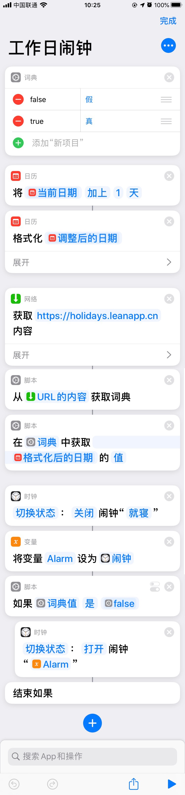
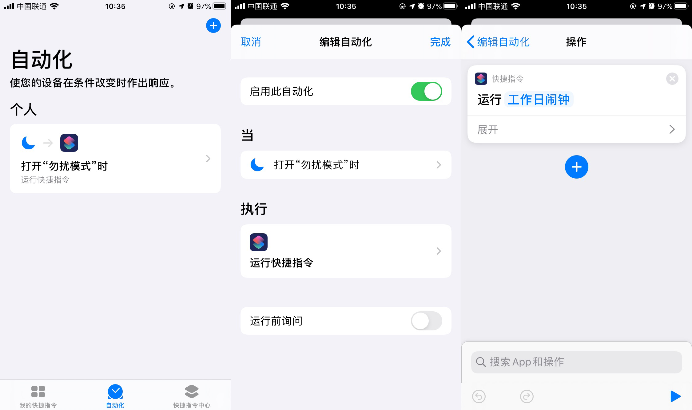

# 自动工作日闹钟
这个捷径会拉取法定节假日并自动开关指定的闹钟，可以通过「自动化」配置为每天运行，对第二天的闹钟进行设置。

最新版本：[v3](https://www.icloud.com/shortcuts/37d5c6fc5eec441aa7b4b557e27952c2)（点击安装）

## 配置

安装时会自动询问你要操作的闹钟，在安装后还需配置一个自动任务来每天运行这个捷径，例如设置为「打开勿扰模式时」执行（这里假设打开勿扰模式发生在闹钟之后，否则就不是设置第二天的闹钟了）：

## 用到的 API
这个捷径用到了一个搭建在 [云引擎](https://www.leancloud.cn/engine) 上的 API（[holidays.leanapp.cn](https://holidays.leanapp.cn)）来获取假日信息，数据来源是我司的请假系统，由我司 HR 录入维护。

## 历史版本

- [v3](https://www.icloud.com/shortcuts/37d5c6fc5eec441aa7b4b557e27952c2) 在安装时询问要操作的闹钟。
- [v2](https://www.icloud.com/shortcuts/1233053576a14cb6be83af4f0864fbdd) 修复在中文系统上无法正确工作的问题。
- [v1](https://www.icloud.com/shortcuts/209f46caef40484a881082c1fb2dff92) 首个版本
